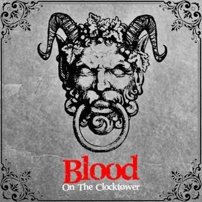

# Blood on the Clocktower

##### Catégories

## Description rapide
Vous incarnez des villageois terrorisé par un démon qui se déguise le jour et tue la nuit. Avec les autres villageois et vos pouvoirs, menez l'enquête pour tenter de découvrir et tuer le démon avant qu'il ne soit trop tard.

---

## Description
Dans le calme village de Ravenswood, un démon sème la terreur...

Lors d'un orage infernal, sur le coup de minuit, résonne un cri à vous glacer le sang. Les habitants se précipitent pour enquêter et trouver le conteur de la ville assassiné, leur corps empalé sur les aiguilles de la tour de l'horloge, du sang coulant sur les pavés en dessous.

Un démon est en liberté, tuant la nuit et déguisé en humain le jour. Certains ont des bribes d'informations. D'autres ont des capacités qui combattent le mal ou protègent les innocents. Mais le Démon et ses sbires diaboliques répandent des mensonges pour semer la confusion et susciter la suspicion.

Les bons villageois vont-ils résoudre le puzzle à temps pour exécuter le vrai démon et se sauver eux-mêmes ? Ou le mal envahira-t-il ce village autrefois paisible ?

**Blood on the Clocktower** est un jeu de bluff pour jouer entre 5 à 20 joueurs dans des équipes adverses du Bien et du Mal, supervisé par un joueur **Conteur** qui mène l'action et prend des décisions cruciales.

Au cours d'une phase de « journée », les joueurs socialisent ouvertement et chuchotent en privé pour échanger des connaissances ou répandre des mensonges, aboutissant à l'exécution d'un joueur si une majorité les soupçonne d'être Maléfiques. D'une « nuit », les joueurs ferment les yeux et sont réveillés un par un par le conteur pour recueillir des informations, semer le trouble ou tuer.

Le conteur utilise les pièces de jeu complexes du jeu pour guider chaque jeu, laissant les autres libres de jouer sans table ni plateau. Les joueurs restent au cœur de l'action jusqu'à la fin même si leurs personnages sont tués, hantant Ravenswood Bluff comme des fantômes essayant de gagner d'outre-tombe.

Si vous arrivez en retard à une partie, vous pouvez entrer après qu'elle ait commencé en tant que personnage Voyageur puissant avec des talents inhabituels et des allégeances douteuses. Chaque personnage a sa propre capacité spéciale et deux joueurs dans un jeu ne sont jamais le même personnage.

---

## Liens
- [Site officiel](https://bloodontheclocktower.com)
- [Règles, scénarios, conseils...](https://wiki.bloodontheclocktower.com/Main_Page)
- [Pour jouer en ligne](https://clocktower.online)

#### Informations complémentaires
- [Fiche BoardGameGeek](https://boardgamegeek.com/boardgame/240980/blood-clocktower)
- [Playlist parties](https://www.youtube.com/playlist?list=PLQBGXhGots83LIf1qY4Zg0Mp9qU1Kr2Hv)
