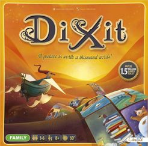

# Dixit

##### Catégories

## Description rapide
Donnez l'indice parfait pour que la plupart des joueurs (pas tous) devinent la bonne carte d'image surréaliste.

---

## Description
Un joueur est le conteur pour le tour et regarde les images sur les 6 cartes dans sa main. A partir de l'une d'elles, elle compose une phrase et la dit à voix haute (sans montrer la carte aux autres joueurs).

Chaque autre joueur sélectionne dans sa main la carte qui correspond le mieux à la phrase et donne la carte choisie au conteur, sans la montrer aux autres.

Le conteur mélange sa carte avec toutes les cartes reçues. Toutes les images sont montrées face visible et chaque joueur doit parier sur quelle image appartenait au conteur.

Si personne ou tout le monde ne trouve la bonne carte, le conteur marque 0 et chacun des autres joueurs marque 2. Sinon, le conteur et celui qui a trouvé la bonne réponse marquent 3. Les joueurs marquent 1 point pour chaque vote pour leur propre carte.

Le jeu se termine lorsque le paquet est vide ou si un joueur marque 30 points. Dans les deux cas, le joueur avec le plus de points remporte la partie.

---

## Liens
- [Règles du jeu](https://www.fgbradleys.com/rules/rules2/Dixit-rules.pdf)
- [Pour pouvoir jouer en ligne](https://play-dixit.online/fr/)

#### Informations complémentaires
- [Fiche BoardGameGeek](https://boardgamegeek.com/boardgame/39856/dixit)

