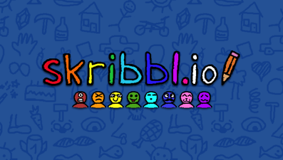

# Skribbl.io

##### Catégories

## Description
Les joueurs passent tour à tour au tableau pour dessiner quelque chose.

Votre but :

- si vous dessinez : faire en sorte que le plus de personnes devinnent ce que vous avez dessiné
- si vous cherchez : de trouver le mot le plus vite possible

Si des personnes trouvent ce que vous avez dessiné ou que vous trouvez le mot dessiné, vous gagnez des points.

La personne ayant le plus de points à la fin des rounds gagne la partie.

---

## Liens
- [Site officiel](https://skribbl.io)
